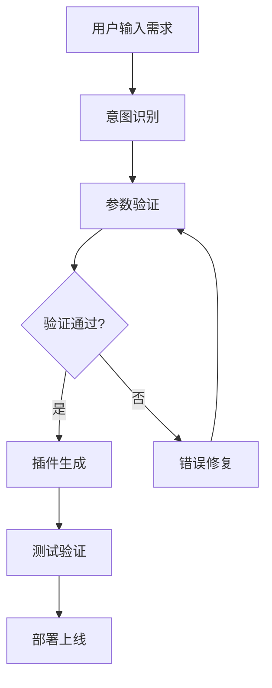

# 🔌 Coze插件系统

## 📋 概述

Coze插件系统是一个完整的、可扩展的插件开发框架，支持自动生成、测试和部署Coze平台插件。

---

## 🏗️ 系统架构

### 核心组件

| 组件 | 功能 | 状态 |
|------|------|------|
| **CozePluginGenerator** | 插件自动生成器 | ✅ |
| **CozeJsonRepairMaster** | JSON修复大师 | ✅ |
| **ParameterValidator** | 参数验证器 | ✅ |
| **WorkflowAutomation** | 工作流自动化引擎 | ✅ |
| **SecuritySystem** | 三重认证安全系统 | ✅ |

### 插件生成流程




## 📝 完整插件配置

### Coze插件JSON配置

```json
{
  "schema_version": "1.0",
  "name_for_human": "全能智能自动化中枢",
  "name_for_model": "universal_automation_processor",
  "description_for_human": "完全自动化的智能处理系统 - 只需输入自然语言需求,系统自动完成工作流管理、插件生成、节点修复、AI增强、数据集成等所有操作",
  "description_for_model": "全能自动化处理系统,用户只需输入自然语言需求描述,系统自动识别意图并完成工作流创建、插件开发、问题修复、数据分析、数据集成等所有操作,无需任何技术配置。",
  "auth": {
    "type": "none"
  },
  "api": {
    "type": "openapi",
    "url": "https://api.coze-automation.com/v1",
    "is_user_authenticated": false
  "input_params": [
      "name": "user_input",
      "type": "string",
      "required": true,
      "description": "请输入您的需求描述",
      "example": "创建一个数据备份工作流"
    }
  ],
  "output_params": [
    { "name": "success", "type": "boolean", "description": "处理是否成功" },
    { "name": "detected_intent", "type": "string", "description": "检测到的用户意图" },
    { "name": "automated_tasks", "type": "array", "description": "自动执行的任务列表" },
    { "name": "generated_outputs", "type": "object", "description": "生成的各类输出结果" },
    { "name": "user_friendly_summary", "type": "string", "description": "用户友好的处理总结" }
  "logo_url": "https://api.auto-ai.com/logo.png",
  "contact_email": "support@auto-ai.com",
  "legal_info_url": "https://auto-ai.com/legal"
```


## ✅ 支持的模块列表

| 模块ID | 模块名称 | 功能描述 |
|--------|----------|----------|
| universal | 统一入口 | 智能路由统一入口 |
| workflow | 工作流自动化 | 工作流创建、修复、执行 |
| plugin | 插件开发 | 插件自动创建与测试 |
| json_fix | JSON修复 | JSON数据修复与格式化 |
| code_fix | 代码修复 | 代码智能修复 |
| ai_training | AI训练 | AI模型训练与数据处理 |
| neural_decision | 神经决策系统 | 智能决策支持 |
| multimedia | 多媒体处理 | 多媒体内容处理 |
| industry_analysis | 行业分析 | 行业数据分析 |
| data_processing | 数据处理 | 数据处理工具 |


## 🔧 工具列表

### 工作流工具

| 工具名称 | 端点 | 方法 |
|---------|------|------|
| workflow_create | /workflow/create | POST |
| workflow_repair | /workflow/repair | POST |
| workflow_generate | /workflow/generate | POST |
| query_workflows | /workflow/query | GET |

### 代码工具

| code_repair | /tools/code-repair | POST |
| json_format | /tools/json-format | POST |
| yaml_to_json | /tools/yaml-to-json | POST |
| json_to_yaml | /tools/json-to-yaml | POST |


## 📎 相关文档

- [全能智能自动化中枢](02_UNIVERSAL_AUTOMATION.md) - 完整自动化系统
- [工作流自动化](06_WORKFLOW_AUTOMATION.md) - Coze工作流修复智能体
- [API规范文档](07_API_SPECIFICATIONS.md) - OpenAPI规范