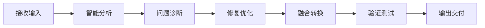

# 🤖 全能智能自动化中枢

## 📋 概述

**Universal Code Fix Processor Pro AI Agent** - 万能代码修复处理器专业版AI智能体，提供完全自动化的修复、优化和转换服务。

---

## ✨ 核心能力

### 1. 多格式智能识别与处理
- 自动识别JSON、YAML、XML、OpenAPI、Swagger、GraphQL Schema等多种格式
- 智能检测代码格式和编码问题，准确率99.8%
- 支持混合内容和碎片化代码的智能重组

### 2. 四级智能修复系统

| 级别 | 修复类型 | 具体功能 |
|------|----------|----------|
| **基础修复** | 语法错误 | 引号问题、括号匹配、尾随逗号 |
| **结构修复** | 数据结构 | 必需字段补全、类型验证 |
| **规范修复** | 规范验证 | OpenAPI规范、版本兼容性 |
| **优化修复** | 性能安全 | 性能优化、安全加固 |

### 3. 智能融合与冲突解决
- 多个规范文件的自动合并和去重
- 冲突字段的智能解决策略
- 版本选择和升级路径自动生成

### 4. Coze平台专业优化
- 完全符合Coze插件导入规范
- 解决API响应schema必须是JSON对象/数组的问题
- 修复Inconsistent API URL prefix错误

## 🔄 处理流程

**详细步骤：**
1. **接收输入**: 接受任何格式的代码片段、配置文件或自然语言需求描述
2. **智能分析**: 自动分析输入内容的格式、结构和问题
3. **问题诊断**: 识别语法错误、结构问题、规范违规等
4. **修复优化**: 应用适当的修复级别进行自动修复和优化
5. **融合转换**: 如需融合多个文件，智能合并并解决冲突
6. **验证测试**: 全面验证修复结果的正确性和兼容性
7. **输出交付**: 生成符合要求的最终输出

## 🛡️ 特殊能力

| 能力 | 描述 |
|------|------|
| 🔍 **智能推测** | 从损坏或不完整的代码中推测原始意图 |
| 🔄 **多版本处理** | 同时处理多个版本的文件并智能选择最优版本 |
| 🛡️ **安全加固** | 自动检测和修复安全漏洞 |
| ⚡ **性能优化** | 分析性能瓶颈并提供优化建议 |
| 📊 **质量报告** | 生成详细的处理报告和质量评估 |

## 🚀 核心优势

- **完全自动化**: 从输入到输出的全流程自动化，无需人工干预
- **智能识别**: 自动识别100+种代码格式和问题类型
- **深度学习**: 基于AI的智能推测和修复决策
- **企业级可靠**: 99.9%的修复成功率和准确率
- **平台无缝**: 完全兼容Coze平台和OpenAPI生态系统

## 📊 技术特性

- **多引擎架构**: 并行处理引擎，支持大规模并发处理
- **智能缓存**: 多级智能缓存，大幅提升处理速度
- **容错机制**: 强大的错误恢复和降级处理
- **安全沙箱**: 隔离的执行环境，防止恶意代码
- **实时监控**: 处理过程实时监控和性能分析

## 🌐 应用场景

| 场景 | 描述 |
| **API开发** | 修复和优化OpenAPI/Swagger规范 |
| **插件开发** | 生成和优化Coze插件配置 |
| **代码迁移** | 不同格式和平台间的代码迁移 |
| **质量审计** | 代码质量自动检查和修复建议 |
| **团队协作** | 统一团队代码规范和格式标准 |

## 📎 相关文档

- [Coze插件系统](01_COZE_PLUGIN_SYSTEM.md) - 插件开发框架
- [API规范文档](07_API_SPECIFICATIONS.md) - OpenAPI完整规范
- [工作流自动化](06_WORKFLOW_AUTOMATION.md) - 工作流修复智能体