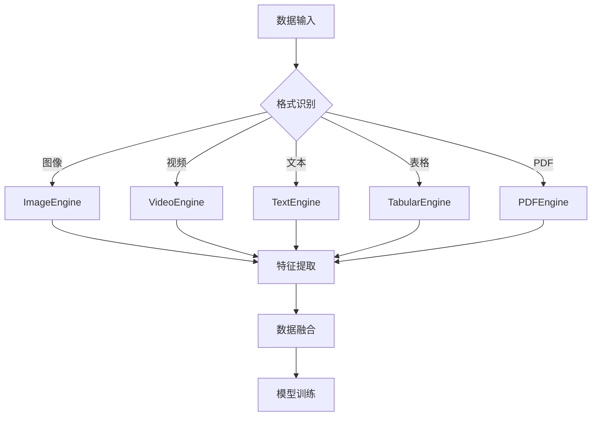

# 🎯 多模态AI训练系统 - Neuro Factory Pro

## 📋 系统概述

**Neuro Factory Pro** - 量子增强AI开发平台，是一个超融合多模态AI训练系统，支持实时数据监控、多模态数据融合训练、超参数自动优化等核心功能。

---

## ⚙️ 系统配置

```python
class Config:
    """系统全局配置"""
    def __init__(self):
        self.version = "v6.0"
        self.system_name = "Neuro Factory Pro - 量子增强AI开发平台"
        self.description = "超融合多模态AI训练系统"
        
        # 路径配置
        self.base_dir = Path.cwd()
        self.data_dir = self.base_dir / "data"
        self.model_dir = self.base_dir / "models"
        self.log_dir = self.base_dir / "logs"
        self.output_dir = self.base_dir / "outputs"
        
        # 创建目录
        for dir_path in [self.data_dir, self.model_dir, self.log_dir, self.output_dir]:
            dir_path.mkdir(exist_ok=True)
            
        # 训练配置
        self.batch_size = 32
        self.epochs = 100
        self.learning_rate = 0.001
        self.max_length = 512
        
        # 数据配置
        self.supported_formats = ['.csv', '.txt', '.json', '.py', '.md']
        self.encoding = 'utf-8'
```


## 🧩 核心功能模块

| 模块 | 功能描述 | 状态 |
|------|----------|------|
| **日志系统** | TreaLogger - 标准化日志管理 | ✅ |
| **配置管理** | ConfigManager - 配置加载与管理 | ✅ |
| **数据验证** | DataValidator - 数据质量检查 | ✅ |
| **数据增强** | DataEnhancer - 智能字段补全 | ✅ |
| **数据清洗** | DataCleaner - 去重与标准化 | ✅ |
| **文件处理** | CSV/Text/Code Processor | ✅ |
| **数据管道** | DataPipeline - 批处理流程 | ✅ |
| **IDE集成** | TreaIDEIntegration | ✅ |


## 🔧 多模态数据处理中心

### 支持的数据格式

| 类型 | 格式 | 处理器 |
|------|------|--------|
| 图像 | jpg, png, jpeg | ImageEngine |
| 视频 | mp4, avi | VideoEngine |
| 文本 | txt, md | TextEngine |
| 表格 | csv | TabularEngine |
| PDF | pdf | PDFEngine |

### 数据处理流程




## 🧠 核心模型架构

### FusionModel - 多模态融合模型

```python
class FusionModel(nn.Module):
    """多模态融合模型（生产级实现）"""
        super().__init__()
        self.device = torch.device("cuda" if torch.cuda.is_available() else "cpu")
        
        # 图像编码器
        self.img_encoder = nn.Sequential(
            nn.Conv2d(3, 64, 3, padding=1),
            nn.BatchNorm2d(64),
            nn.ReLU(),
            nn.MaxPool2d(2),
            nn.Conv2d(64, 128, 3, padding=1),
            nn.BatchNorm2d(128),
            nn.Flatten()
        )
        
        # 文本编码器
        self.text_encoder = nn.LSTM(
            input_size=768,
            hidden_size=256,
            num_layers=2,
            batch_first=True,
            bidirectional=True
        
        # 融合分类器
        self.classifier = nn.Sequential(
            nn.Linear(128*56*56 + 512, 1024),
            nn.BatchNorm1d(1024),
            nn.Dropout(0.3),
            nn.Linear(1024, 512),
            nn.BatchNorm1d(512),
            nn.Dropout(0.2),
            nn.Linear(512, 10)
```


## 🚀 训练系统

### 自动化训练引擎

| 功能 | 描述 |
|------|------|
| **持续训练** | 支持增量训练，自动触发训练流程 |
| **版本管理** | 自动保存模型版本，支持版本回溯 |
| **超参数优化** | 基于Ray Tune的自动调优 |
| **混合精度** | 支持FP16/FP32混合精度训练 |

### 训练触发机制

当处理的数据量达到阈值（每10个文件）时，自动触发训练流程。


## 🌐 API服务系统

### InferenceService - 生产级API服务

| 端点 | 方法 | 功能 |
|------|------|------|
| `/predict` | POST | 多模态推理预测 |
| `/stats` | GET | 获取系统统计信息 |
| `/health` | GET | 健康检查 |


## 📊 系统统计监控

```python
# 统计指标
stats = {
    "total_data": 0,        # 累计处理数据量
    "model_versions": 0,    # 模型版本数
    "training_sessions": 0, # 训练次数
    "last_updated": datetime.now().isoformat()
}
```


## 📎 相关文档

- [AI意识演进架构](03_AI_CONSCIOUSNESS.md) - 意识理论与实现路径
- [文本分类解决方案](05_TEXT_CLASSIFICATION.md) - HuggingFace完整解决方案
- [系统架构设计](10_SYSTEM_ARCHITECTURE.md) - 完整技术栈描述