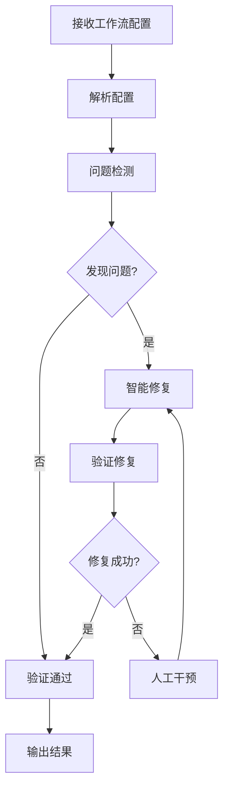

# 🔄 Coze工作流修复智能体

## 📋 概述

Coze工作流修复智能体是一个专业的自动化工具，用于检测和修复Coze平台工作流配置中的各种问题。

---

## 🎯 核心功能

### 工作流修复能力

| 修复类型 | 描述 | 成功率 |
|----------|------|--------|
| **JSON格式修复** | 修复引号、括号、尾随逗号等语法问题 | 99.8% |
| **schema验证** | 验证API响应schema必须是JSON对象/数组 | 99.5% |
| **URL一致性** | 修复Inconsistent API URL prefix错误 | 99.0% |
| **参数完整性** | 补全必需字段和参数 | 98.5% |
| **配置优化** | 优化工作流配置结构 | 98.0% |

### 支持的修复场景

| 场景 | 问题描述 | 解决方案 |
|------|----------|----------|
| API响应错误 | API响应schema必须是JSON对象或数组 | 自动包装或转换schema |
| URL前缀不一致 | API路径与基础URL不匹配 | 自动对齐URL前缀 |
| 参数缺失 | 必需参数未定义 | 智能补全缺失参数 |
| 语法错误 | JSON格式错误 | 自动修复语法问题 |


## 🔧 工具集成

### 工具列表

| 工具名称 | 功能 | 端点 |
|----------|------|------|
| **工作流创建** | 创建新的工作流 | /workflow/create |
| **工作流修复** | 修复现有工作流 | /workflow/repair |
| **工作流生成** | 根据需求自动生成工作流 | /workflow/generate |
| **工作流查询** | 查询工作流列表 | /workflow/query |
| **代码修复** | 修复代码问题 | /tools/code-repair |
| **JSON格式化** | 格式化JSON数据 | /tools/json-format |
| **YAML转JSON** | 格式转换 | /tools/yaml-to-json |
| **JSON转YAML** | 格式转换 | /tools/json-to-yaml |

### 工具调用示例

```python
import requests

# 修复工作流
response = requests.post(
    "https://api.coze-automation.com/workflow/repair",
    json={
        "workflow_id": "workflow_123",
        "repair_type": "auto",
        "options": {
            "validate_schema": True,
            "fix_url_prefix": True,
            "complete_params": True
        }
)

# 生成工作流
    "https://api.coze-automation.com/workflow/generate",
        "requirement": "创建一个数据备份工作流，每天凌晨2点执行",
        "template": "standard",
        "schedule": "0 2 * * *"
```


## 🔄 修复流程



### 详细步骤

1. **接收配置**: 获取工作流JSON配置文件
2. **解析配置**: 解析JSON结构，提取关键信息
3. **问题检测**: 检测schema、URL、参数等问题
4. **智能修复**: 自动修复检测到的问题
5. **验证修复**: 验证修复后的配置是否符合规范
6. **输出结果**: 返回修复后的工作流配置


## ✅ 验证规则

### Schema验证

```json
{
  "type": "object",
  "properties": {
    "api": {
        "type": { "enum": ["openapi", "graphql", "rest"] },
        "url": { "type": "string", "format": "uri" },
        "is_user_authenticated": { "type": "boolean" }
      },
      "required": ["type", "url"]
    "auth": {
        "type": { "enum": ["none", "api_key", "oauth2", "basic"] }
      "required": ["type"]
    "input_params": {
      "type": "array",
      "items": {
          "name": { "type": "string" },
          "type": { "enum": ["string", "number", "boolean", "array", "object"] },
          "required": { "type": "boolean" },
          "description": { "type": "string" }
        "required": ["name", "type"]
    "output_params": {
  "required": ["api", "auth", "input_params", "output_params"]
```


## 📊 修复报告

### 报告结构

| 字段 | 类型 | 说明 |
|------|------|------|
| workflow_id | string | 工作流ID |
| status | string | 修复状态(success/failed) |
| issues_found | integer | 发现的问题数量 |
| issues_fixed | integer | 已修复的问题数量 |
| warnings | array | 警告信息列表 |
| repaired_config | object | 修复后的配置 |
| timestamp | string | 修复时间戳 |

### 报告示例

```json
  "status": "success",
  "issues_found": 3,
  "issues_fixed": 3,
  "warnings": [],
  "repaired_config": { ... },
  "timestamp": "2024-01-15T10:30:00Z"
```


## 📎 相关文档

- [Coze插件系统](01_COZE_PLUGIN_SYSTEM.md) - 插件开发框架
- [全能智能自动化中枢](02_UNIVERSAL_AUTOMATION.md) - 完整自动化系统
- [API规范文档](07_API_SPECIFICATIONS.md) - OpenAPI完整规范