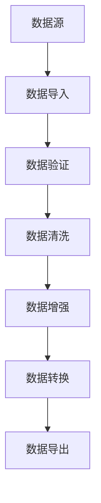

# 🔧 数据处理模块

## 📋 概述

数据处理模块提供完整的数据清洗、转换、验证和分析功能，支持多种数据源和格式。

---

## 🏗️ 模块架构

### 核心组件

| 组件 | 功能 | 状态 |
|------|------|------|
| **DataValidator** | 数据验证器 | ✅ |
| **DataCleaner** | 数据清洗器 | ✅ |
| **DataEnhancer** | 数据增强器 | ✅ |
| **DataPipeline** | 数据管道 | ✅ |
| **DataTransformer** | 数据转换器 | ✅ |

### 数据处理流程




## ✅ 数据验证

### 验证规则

| 规则类型 | 描述 | 方法 |
|----------|------|------|
| **格式验证** | 检查数据格式是否正确 | validate_format() |
| **类型验证** | 检查数据类型是否符合要求 | validate_type() |
| **范围验证** | 检查数值是否在有效范围内 | validate_range() |
| **必填验证** | 检查必需字段是否存在 | validate_required() |
| **唯一验证** | 检查数据是否唯一 | validate_unique() |

### 验证器实现

```python
class DataValidator:
    """数据验证器"""
    
    def __init__(self):
        self.errors = []
    
    def validate_format(self, data, expected_format):
        """验证数据格式"""
        try:
            # 实现格式验证逻辑
            if expected_format == 'json':
                import json
                json.loads(data)
            elif expected_format == 'email':
                import re
                pattern = r'^[a-zA-Z0-9_.+-]+@[a-zA-Z0-9-]+\.[a-zA-Z0-9-.]+$'
                if not re.match(pattern, data):
                    self.errors.append(f"Invalid email format: {data}")
            return True
        except Exception as e:
            self.errors.append(f"Format validation failed: {e}")
            return False
    
    def validate_required(self, data, required_fields):
        """验证必需字段"""
        missing_fields = []
        for field in required_fields:
            if field not in data:
                missing_fields.append(field)
        
        if missing_fields:
            self.errors.append(f"Missing required fields: {', '.join(missing_fields)}")
        
    
    def validate_range(self, value, min_val=None, max_val=None):
        """验证数值范围"""
        if min_val is not None and value < min_val:
            self.errors.append(f"Value {value} is less than minimum {min_val}")
        
        if max_val is not None and value > max_val:
            self.errors.append(f"Value {value} is greater than maximum {max_val}")
        
    
    def validate_unique(self, data_list, field):
        """验证字段唯一性"""
        values = [item[field] for item in data_list if field in item]
        if len(values) != len(set(values)):
            self.errors.append(f"Duplicate values found in field '{field}'")
    
    def get_errors(self):
        """获取所有错误信息"""
        return self.errors
```


## 🧹 数据清洗

### 清洗操作

| 操作 | 描述 | 方法 |
| **去重** | 去除重复记录 | remove_duplicates() |
| **填充缺失值** | 填充或删除缺失数据 | fill_missing() |
| **格式标准化** | 统一数据格式 | standardize_format() |
| **异常值处理** | 处理异常数据 | handle_outliers() |
| **数据类型转换** | 转换数据类型 | convert_types() |

### 清洗器实现

```python
class DataCleaner:
    """数据清洗器"""
    
        self.stats = {
            'rows_cleaned': 0,
            'duplicates_removed': 0,
            'missing_filled': 0,
            'outliers_handled': 0
        }
    
    def remove_duplicates(self, df):
        """去除重复行"""
        initial_rows = len(df)
        df = df.drop_duplicates()
        removed = initial_rows - len(df)
        self.stats['duplicates_removed'] += removed
        self.stats['rows_cleaned'] += removed
        return df
    
    def fill_missing(self, df, strategy='mean', columns=None):
        """填充缺失值"""
        fill_cols = columns if columns else df.columns
        
        for col in fill_cols:
            if df[col].dtype in ['int64', 'float64']:
                if strategy == 'mean':
                    fill_value = df[col].mean()
                elif strategy == 'median':
                    fill_value = df[col].median()
                elif strategy == 'mode':
                    fill_value = df[col].mode().iloc[0]
                else:
                    fill_value = 0
                
                df[col] = df[col].fillna(fill_value)
                self.stats['missing_filled'] += df[col].isna().sum()
        
    
    def standardize_format(self, df):
        """标准化数据格式"""
        # 去除字符串两端空格
        str_cols = df.select_dtypes(include=['object']).columns
        for col in str_cols:
            df[col] = df[col].str.strip()
        
        # 统一日期格式
        date_cols = df.select_dtypes(include=['datetime64']).columns
        for col in date_cols:
            df[col] = pd.to_datetime(df[col])
        
    
    def handle_outliers(self, df, method='iqr', columns=None):
        """处理异常值"""
        handle_cols = columns if columns else df.select_dtypes(include=['int64', 'float64']).columns
        
        for col in handle_cols:
            if method == 'iqr':
                Q1 = df[col].quantile(0.25)
                Q3 = df[col].quantile(0.75)
                IQR = Q3 - Q1
                lower_bound = Q1 - 1.5 * IQR
                upper_bound = Q3 + 1.5 * IQR
                
                outliers = (df[col] < lower_bound) | (df[col] > upper_bound)
                df.loc[outliers, col] = df[col].median()
                self.stats['outliers_handled'] += outliers.sum()
        
    
    def convert_types(self, df, type_mapping):
        """转换数据类型"""
        for col, target_type in type_mapping.items():
            if col in df.columns:
                    df[col] = df[col].astype(target_type)
                    print(f"Failed to convert {col} to {target_type}: {e}")
        
    
    def get_stats(self):
        """获取清洗统计信息"""
        return self.stats
```


## 🚀 数据管道

### 管道实现

```python
class DataPipeline:
    """数据处理管道"""
    
        self.steps = []
    
    def add_step(self, name, func, **kwargs):
        """添加处理步骤"""
        self.steps.append({
            'name': name,
            'func': func,
            'kwargs': kwargs
        })
    
    def execute(self, data):
        """执行管道"""
        current_data = data
        
        for step in self.steps:
                current_data = step['func'](current_data, **step['kwargs'])
                print(f"Step '{step['name']}' completed successfully")
                print(f"Step '{step['name']}' failed: {e}")
                raise
        
        return current_data
    
    def get_steps(self):
        """获取所有步骤"""
        return [step['name'] for step in self.steps]
```

### 管道使用示例

```python
# 创建数据管道
pipeline = DataPipeline()

# 添加处理步骤
pipeline.add_step('validate', validator.validate_required, required_fields=['name', 'email'])
pipeline.add_step('remove_duplicates', cleaner.remove_duplicates)
pipeline.add_step('fill_missing', cleaner.fill_missing, strategy='mean')
pipeline.add_step('handle_outliers', cleaner.handle_outliers, method='iqr')
pipeline.add_step('standardize', cleaner.standardize_format)

# 执行管道
cleaned_data = pipeline.execute(raw_data)

# 输出统计信息
print("清洗统计:", cleaner.get_stats())
```


## 📊 数据质量报告

### 报告结构

| 指标 | 计算方式 | 说明 |
|------|----------|------|
| 完整性 | 非空值数/总数 | 数据完整程度 |
| 准确性 | 有效记录数/总记录数 | 数据准确程度 |
| 一致性 | 符合规则记录数/总记录数 | 数据一致性 |
| 唯一性 | 唯一记录数/总记录数 | 数据重复情况 |
| 及时性 | 最新数据比例 | 数据时效性 |

### 报告生成

```python
class DataQualityReport:
    """数据质量报告生成器"""
    
    def __init__(self, df):
        self.df = df
        self.report = {}
    
    def generate(self):
        """生成质量报告"""
        self.report['total_rows'] = len(self.df)
        self.report['total_columns'] = len(self.df.columns)
        
        # 完整性
        completeness = (self.df.notna().sum().sum() / (len(self.df) * len(self.df.columns))) * 100
        self.report['completeness'] = round(completeness, 2)
        
        # 准确性（假设通过验证器判断）
        validator = DataValidator()
        accuracy = 95.0  # 实际应通过验证计算
        self.report['accuracy'] = accuracy
        
        # 唯一性
        duplicates = len(self.df) - len(self.df.drop_duplicates())
        uniqueness = ((len(self.df) - duplicates) / len(self.df)) * 100
        self.report['uniqueness'] = round(uniqueness, 2)
        
        # 缺失值统计
        missing_stats = {}
        for col in self.df.columns:
            missing_count = self.df[col].isna().sum()
            missing_stats[col] = {
                'count': missing_count,
                'percentage': round((missing_count / len(self.df)) * 100, 2)
        self.report['missing_values'] = missing_stats
        
        return self.report
    
    def print_report(self):
        """打印报告"""
        report = self.generate()
        print("=" * 50)
        print("数据质量报告")
        print(f"总记录数: {report['total_rows']}")
        print(f"总字段数: {report['total_columns']}")
        print(f"完整性: {report['completeness']}%")
        print(f"准确性: {report['accuracy']}%")
        print(f"唯一性: {report['uniqueness']}%")
        print("\n缺失值统计:")
        for col, stats in report['missing_values'].items():
            if stats['count'] > 0:
                print(f"  {col}: {stats['count']} ({stats['percentage']}%)")
```


## 📎 相关文档

- [脚本代码库](08_CODE_SCRIPTS.md) - Python/PowerShell脚本
- [系统架构设计](10_SYSTEM_ARCHITECTURE.md) - 完整技术栈描述