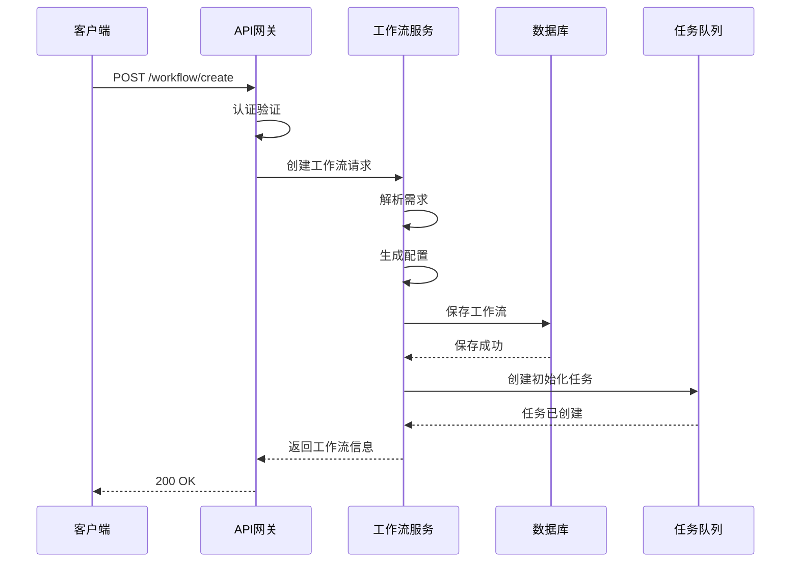

# 🏗️ 系统架构设计

## 📋 概述

完整的智能自动化平台技术架构设计文档，包含系统架构、技术选型、部署方案和安全设计。

---

## 🏢 整体架构

### 架构视图

```mermaid
graph TB
    subgraph 用户层
        A[Web前端]
        B[API客户端]
        C[移动App]
    end
    
    subgraph 网关层
        D[API Gateway]
    
    subgraph 服务层
        E[工作流服务]
        F[插件服务]
        G[代码修复服务]
        H[AI训练服务]
        I[数据处理服务]
    
    subgraph 数据层
        J[关系数据库]
        K[缓存系统]
        L[文件存储]
        M[向量数据库]
    
    subgraph 基础设施层
        N[云服务器]
        O[容器编排]
        P[监控告警]
    
    A --> D
    B --> D
    C --> D
    D --> E
    D --> F
    D --> G
    D --> H
    D --> I
    E --> J
    E --> K
    F --> J
    F --> L
    G --> J
    H --> M
    I --> K
    I --> L
```

### 架构特点

| 特性 | 描述 |
|------|------|
| **微服务架构** | 各服务独立部署，松耦合 |
| **API网关** | 统一入口，负载均衡，安全控制 |
| **事件驱动** | 基于消息队列的异步处理 |
| **弹性伸缩** | 根据负载自动调整资源 |
| **高可用性** | 多活部署，故障自动转移 |


## 🛠️ 技术栈

### 后端技术

| 分类 | 技术 | 版本 | 用途 |
|------|------|------|------|
| **语言** | Python | 3.11+ | 主要开发语言 |
| **框架** | FastAPI | 0.104+ | Web服务框架 |
| **数据库** | PostgreSQL | 15+ | 关系型数据存储 |
| **缓存** | Redis | 7.0+ | 缓存和会话管理 |
| **消息队列** | RabbitMQ | 3.12+ | 异步任务处理 |
| **向量数据库** | Pinecone | - | 向量检索 |
| **容器** | Docker | 24+ | 容器化部署 |
| **编排** | Kubernetes | 1.28+ | 容器编排 |

### 前端技术

| **框架** | Vue.js | 3.4+ | 前端框架 |
| **UI库** | Element Plus | 2.4+ | UI组件库 |
| **图表** | ECharts | 5.4+ | 数据可视化 |
| **构建工具** | Vite | 5.0+ | 构建工具 |

### AI技术

| 分类 | 技术 | 用途 |
|------|------|------|
| **框架** | PyTorch | 2.1+ | 深度学习框架 |
| **模型库** | HuggingFace Transformers | 4.36+ | 预训练模型 |
| **训练框架** | Ray | 2.8+ | 分布式训练 |
| **优化** | ONNX Runtime | 1.16+ | 推理优化 |


## 📁 目录结构

```
backend/
├── app/
│   ├── api/                    # API路由
│   │   ├── v1/
│   │   │   ├── workflow.py     # 工作流API
│   │   │   ├── plugin.py       # 插件API
│   │   │   ├── tools.py        # 工具API
│   │   │   └── ai.py           # AI服务API
│   ├── core/                   # 核心模块
│   │   ├── config.py           # 配置管理
│   │   ├── logger.py           # 日志系统
│   │   ├── security.py         # 安全模块
│   │   └── exceptions.py       # 异常处理
│   ├── services/               # 业务服务
│   │   ├── workflow_service.py
│   │   ├── plugin_service.py
│   │   ├── repair_service.py
│   │   └── ai_service.py
│   ├── models/                 # 数据模型
│   │   ├── workflow.py
│   │   ├── plugin.py
│   │   └── task.py
│   ├── schemas/                # 数据模式
│   │   ├── request.py
│   │   └── response.py
│   ├── utils/                  # 工具函数
│   ├── main.py                 # 应用入口
│   └── Dockerfile
├── tests/                      # 测试目录
├── docs/                       # 文档
├── docker-compose.yml          # 容器编排
└── requirements.txt            # 依赖列表
```


## 🔄 核心数据流

### 工作流创建流程



### AI推理流程

```mermaid
    participant API as API服务
    participant AI as AI服务
    participant Model as 模型服务
    participant Cache as 缓存
    
    Client->>API: POST /ai/inference
    API->>Cache: 检查缓存
    alt 缓存命中
        Cache-->>API: 返回缓存结果
        API-->>Client: 200 OK (缓存)
    else 缓存未命中
        Cache-->>API: 缓存未命中
        API->>AI: 执行推理请求
        AI->>Model: 调用模型
        Model-->>AI: 返回结果
        AI->>AI: 后处理
        AI->>Cache: 保存结果
        AI-->>API: 返回结果
        API-->>Client: 200 OK
```


## 🛡️ 安全设计

### 认证与授权

| 组件 | 功能 | 实现方式 |
|------|------|----------|
| **API Key** | API访问认证 | HTTP Header |
| **OAuth2** | 用户授权 | 授权码流程 |
| **JWT** | 身份令牌 | 无状态认证 |
| **RBAC** | 角色权限控制 | 基于角色的访问控制 |

### 安全措施

| 措施 | 描述 |
| **输入验证** | 所有输入参数严格验证 |
| **SQL注入防护** | 使用ORM和参数化查询 |
| **XSS防护** | 前端转义和后端过滤 |
| **CSRF防护** | Token验证 |
| **数据加密** | 传输加密(TLS)，存储加密 |
| **访问日志** | 完整的访问记录和审计 |


## 📊 监控与运维

### 监控指标

| 指标类型 | 监控内容 |
|----------|----------|
| **服务指标** | CPU、内存、磁盘、网络 |
| **业务指标** | 请求数、响应时间、错误率 |
| **数据库指标** | 查询性能、连接数、慢查询 |
| **队列指标** | 队列长度、处理延迟 |

### 告警策略

| 告警级别 | 触发条件 | 通知方式 |
|----------|----------|----------|
| **CRITICAL** | 服务宕机、数据库不可用 | 电话、短信 |
| **WARNING** | 响应时间超过阈值、错误率上升 | 邮件、钉钉 |
| **INFO** | 部署完成、配置变更 | 日志记录 |


## 🚀 部署方案

### 开发环境

```yaml
# docker-compose.dev.yml
services:
  api:
    build: .
    ports:
      - "8000:8000"
    environment:
      - ENV=development
      - DATABASE_URL=postgresql://user:pass@db:5432/app
    depends_on:
      - db
      - redis
  
  db:
    image: postgres:15
    volumes:
      - postgres_data:/var/lib/postgresql/data
  
  redis:
    image: redis:7
```

### 生产环境

- **云服务商**: 阿里云/腾讯云/AWS
- **容器编排**: Kubernetes
- **负载均衡**: Nginx/Cloud Load Balancer
- **数据库**: 云数据库RDS
- **缓存**: 云缓存Redis
- **存储**: 对象存储OSS


## 📈 性能优化

### 优化策略

| 优化方向 | 策略 |
|----------|------|
| **缓存优化** | Redis多级缓存、热点数据预热 |
| **数据库优化** | 索引优化、读写分离、分库分表 |
| **代码优化** | 异步处理、批量操作、算法优化 |
| **部署优化** | CDN加速、边缘计算、就近接入 |

### 性能指标目标

| 指标 | 目标值 |
|------|--------|
| **P95响应时间** | < 200ms |
| **并发处理能力** | 1000+ QPS |
| **可用性** | 99.9% |
| **数据一致性** | 最终一致性 |


## 📎 相关文档

- [Coze插件系统](01_COZE_PLUGIN_SYSTEM.md) - 插件开发框架
- [API规范文档](07_API_SPECIFICATIONS.md) - OpenAPI完整规范
- [多模态AI训练系统](04_MULTIMODAL_SYSTEM.md) - 超融合训练平台