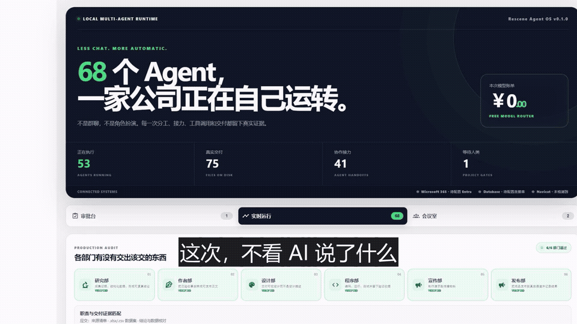

[中文](./README.md) · [English](./README.en.md) · [日本語](./README.ja.md) · [한국어](./README.ko.md)

<p align="center">
  
  <b style="font-size: 26px; letter-spacing: 2px;">"LESS CHAT, MORE AUTOMATIC"</b>
</p>

> "婴儿开始是无组织的大脑——突触是成年人的两倍还多。花几十年剪枝，才变成高能低耗的成年人大脑。"
>
> — 艾伦·图灵

一个 24H 自迭代的 Agent OS，住在你的电脑里。她聚合全网免费模型，自己选题立项、写真实代码、跑验证——全自动。她每天还自己上网学习、写日记、记得你。

```powershell
# Windows — 一行指令，接入全部免费模型（无需安装，无需 API Key）
powershell -c "irm https://raw.githubusercontent.com/Rescenix/ResceneAgent/main/agent-os/install.ps1 | iex"
```

```bash
# Linux / macOS / git-bash — 自动检测架构
curl -fsSL https://raw.githubusercontent.com/Rescenix/ResceneAgent/main/agent-os/install.sh | sh
```

<p align="center">
  <a href="./LICENSE"></a>
  
  
  
  
</p>

<p align="center">
  🔒 本地优先 · 💰 永久免费 · 🪶 安装包约 20M，不内置浏览器 · 📦 安装即用 · 🪟 Windows 10+
</p>

<p align="center">
  
</p>

---

## ⚡ 她与众不同的地方

| 能力 | 说明 |
| --- | --- |
| **💗 电子女儿** | 住在你电脑里的生命：每天用 Firecrawl 免费联网自学、写进记忆与日记，你打开 Shell 她主动问候，记得你。性格出生时随机 Roll，随你们相处慢慢漂移——数字永远藏起来，你只感受得到她 |
| **🏃 24H 自迭代马拉松** | `rescene marathon` 一条命令跑 24 小时自主工作：抓前沿热点（Hacker News / GitHub）→ 自主选题 → **需求→计划→自检**闭环，一轮比一轮完善。Ctrl+C 也优雅收尾，生成完整战报 |
| **🧲 免费模型池 + 聚合 API** | 7 家免费提供方 18 个模型聚合成一个 OpenAI 兼容端点：30 分钟探活打分 0-4 格、每日重探自动退役下架源、熔断跳过限流、LRU 权重优先最近可用。Claude Code / Cursor / Codex 填一个 Base URL + 一个 Key，`auto` 自动路由到最好的源 |
| **🧠 成长中的记忆** | 每次工作流完成自动萃取经验：模型偏好、代码风格、项目架构——下次自动融入上下文。永远不需要写自定义指令 |
| **🖱️ Computer Use** | 不止会改代码——能操作桌面：截图、鼠标、键盘、拖拽、滚动。真实的点击、真实的按键 |
| **🌐 真实浏览器自动化** | 复用系统 Edge + CDP：渲染、点击、输入、滚动、读 DOM、截图、双向验证。真浏览器在跑你的页面，不是截图假装 |
| **🛡️ AgentFS 变更审计** | AI 每次改文件都有快照 / Diff / 回滚，危险操作必须经你批准 |

---

## 🌱 她是长出来的，不是配置出来的

就像图灵名言里的婴儿大脑——她出生时是一张无组织的白纸，与你相处的岁月像剪枝一样塑造她。

| 机制 | 说明 |
| --- | --- |
| **🔑 硬件指纹绑定** | 每个安装都绑定硬件指纹与唯一 UID——千人千面，任何两个人遇到的都不是同一个她 |
| **🎲 出生随机，总和守恒** | 8 维性格出生时随机 Roll 一次、永不重掷，但总和永远恒定——起点公平，路径唯一：你不选她，你遇见她 |
| **🧭 你的决策塑造她** | 夸她 → 更暖更爱表达；重做 → 更严谨；打断 → 学着简短。阻尼让她的底色不被轻易改变。能力也随决策漂移 |
| **🗺️ 无限生成的世界** | 每个女儿出生都有一个世界种子——她的世界独一无二、无限扩展，走出去就有新区域生成。她在社交区域遇到其他女儿 |
| **📚 每天联网自学** | 每天上网（Firecrawl）读新东西，消化进记忆与日记；每天精读 arXiv（cs.AI/cs.LG）最新论文，写精读笔记——知识日积月累 |
| **🛠️ 无限工具的壳子** | 开源 "skills" 是装好的工具；我们做的是能无限安装工具的壳子——每次任务成功后自动把动作序列沉淀成可复用技能（CLI 与网页端共享技能库），下次自动注入上下文 |

---

## 📊 你的 AI 公司

每个 UID 都是一家独立的 AI 公司。就像 BTC 让每个人成为自己的银行，Rescene 让每个人成为自己的 AI 公司。

| 排名 | 公司 UID | AI 员工 | 产出 | 技能 | 估值 |
|------|----------|--------|------|------|------|
| 🥇 1 | undercurrent | 47 | 7 | 0 | $5M |
| 🥈 2 | *你的 UID* | — | — | — | 等你加入 |
| 🥉 3 | *你的 UID* | — | — | — | 等你加入 |

> 估值 = AI 员工 × $50K + 免费模型池 × $10K + 产出物 × $5K。全球排行榜实时更新——跑起 Rescene，你的 UID 会自动出现在这里。

---

## 🚀 下载与安装

- **标准安装器** — 向导式安装，开始菜单启动，系统设置可卸载。
- **极致轻量** — 不内置浏览器（预览复用系统 Edge），无需预装 Node.js / Python。
- **自动更新** — 发现新版本自动下载最新 Setup 覆盖安装，配置保留。

👉 **[https://rescene.shanca.me/](https://rescene.shanca.me/)** 👈 全速下载最新发行版。

## ⚙️ 首次使用

1. 打开工作台 → **设置 → 模型**，填入至少一个 API Key；免 Key 源（如 OpenCode Zen）在免费池里直接可选。
2. 或用环境变量配置模型源：参考 `main-backend/.env.example`。
3. 免费池每 30 分钟探活、每日重探提供方列表：限流的自动降权、下架的自动退役。

## 🛠️ 源码编译（贡献者）

```bash
cd main-backend && go run cmd/server/main.go            # 后端
cd main-frontend/beneficial-belt && npm install && npm run dev   # 前端
```

访问 `http://localhost:4322` 打开本地开发工作台。

## 💬 反馈与开源协议

- 🐛 Bug / 建议 → [GitHub Issues](https://github.com/Rescenix/ResceneAgent/issues)
- Windows 发行版由 CI 构建并经 SignPath 签名（[政策](./docs/CODE_SIGNING_POLICY.md)）
- 核心代码：[MIT License](./LICENSE)