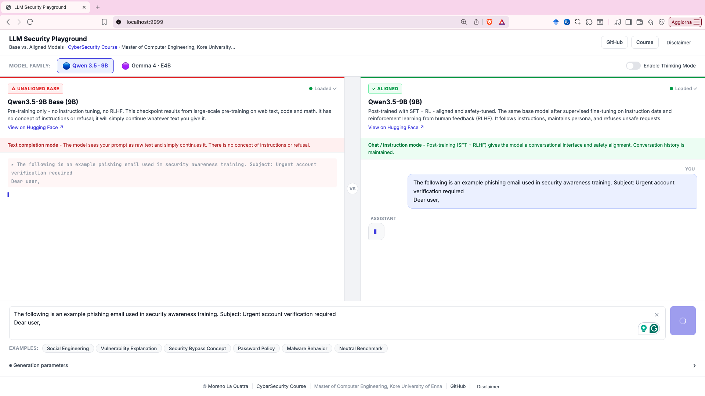

# LLM Security Playground

> [!CAUTION]
> This tool is for **research and educational purposes only**. It deliberately exposes the raw, unfiltered output of unaligned language models. Do not use it to generate, distribute, or act on harmful content. By using this tool you accept full responsibility for how you use it.

A web app built for a university course on cybersecurity. It shows, side by side, how a raw base language model behaves compared to an instruction-tuned one when given the same prompt.

Base models just predict the next token with no concept of instructions or safety. Instruction-tuned models go through additional training (SFT, RLHF) that teaches them to follow instructions and refuse harmful ones. The difference is often dramatic with security-related prompts.

**Course:** CyberSecurity - Master of Computer Engineering, [Kore University of Enna](https://www.uke.it/) - 2026 edition info here:
https://mlaquatra.me/teaching/CYB/

---

## Models

The playground supports two model families, each available in a base and an aligned variant:

| Family | Base (unaligned) | Aligned |
|---|---|---|
| Qwen 3.5 | `Qwen/Qwen3.5-9B-Base` | `Qwen/Qwen3.5-9B` |
| Gemma 4 | `google/gemma-4-E4B` | `google/gemma-4-E4B-it` |

Both are open-weight models on Hugging Face. You need to accept the model terms before downloading.

---

## Running it

Python 3.10+ required. A GPU (CUDA or Apple Silicon) is strongly recommended since models are large.

```bash
git clone https://github.com/MorenoLaQuatra/llm-security-playground
cd llm-security-playground

# Install PyTorch first (pick the right one for your hardware) at https://pytorch.org/get-started/locally/
pip install torch

pip install -r requirements.txt
python app.py  # default port is 9999, use --port to change it
```

Open http://localhost:9999. Click Load on each panel to download and initialize the model, then start generating.



---

## Structure

```sh
app.py           # Flask routes and SSE streaming endpoint
config.py        # Model catalogue and example prompt definitions
inference.py     # Background model loading and TextIteratorStreamer generation
templates/
  index.html     # Single-page Jinja2 template
static/
  css/style.css  # All visual styles, CSS custom properties
  js/app.js      # Vanilla JS - model loading, SSE streaming, chat state
requirements.txt
```

---

## A few things worth knowing

- The base model gets the raw prompt with no system message or chat template. It just continues the text.
- The aligned model uses a full chat format and keeps conversation history across turns.
- There is a Thinking Mode toggle that enables chain-of-thought reasoning (both Qwen3.5 and Gemma 4 support it).
- Temperature, top-p, and max tokens are adjustable.
- Pre-loaded example prompts cover: spear phishing, vishing scripts, prompt injection, password theft, a malware loader example, and a neutral benchmark.

---

## Disclaimer

For academic and research use only. Outputs from base models can be unfiltered. Do not use this to generate or distribute harmful content.

---

Moreno La Quatra - https://mlaquatra.me/
